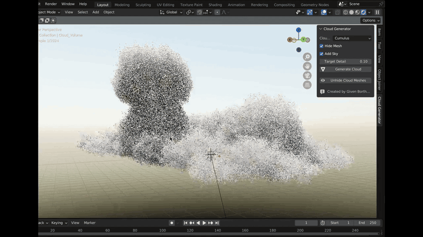
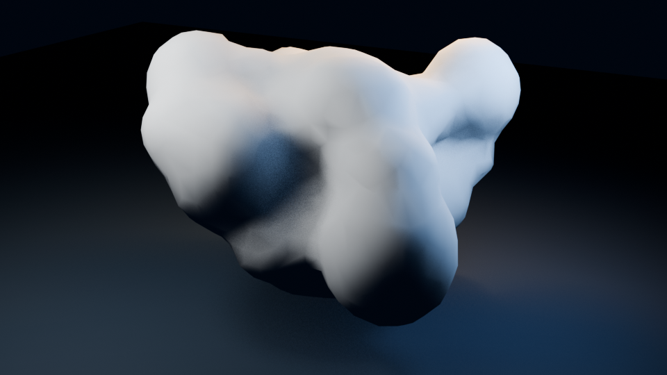

# Cloud Generator for Blender

[](https://github.com/bgivenb/blender-cloud-generator/actions/workflows/test.yml)

A Blender add-on for generating stylized cumulus, cumulonimbus, and stratus clouds from repeatable procedural layouts. A seed and a small set of bounded controls produce a joined, remeshed cloud mesh with optional volume conversion and sky setup.

<a href="https://www.reddit.com/r/blender/comments/1gqi1mj/i_made_a_cloud_generator_plugin_free_download/"></a>

*Excerpt from the original Blender walkthrough. [Watch the complete demo and discussion on r/blender](https://www.reddit.com/r/blender/comments/1gqi1mj/i_made_a_cloud_generator_plugin_free_download/).*

### Current deterministic mesh output



## Design

- **Repeatable:** the same cloud type, chunk count, and seed generate the same sphere plan.
- **Controllable:** chunk count, voxel size, and decimation ratio make the quality/performance trade-off explicit.
- **Non-destructive by default:** source objects are generated in a dedicated collection; optional volume conversion can hide rather than delete its source mesh.
- **Failure-aware:** incomplete generated collections are cleaned up if the Blender operation fails.
- **Testable:** procedural planning is isolated in `cloud_core.py` and covered without requiring Blender.

## Install

1. Run `python scripts/package_addon.py` from a source checkout to create the installable archive and its SHA-256 checksum in `dist/`.
2. In Blender 3.6 or newer, open **Edit → Preferences → Add-ons → Install** and select `dist/cloud-generator-v2.0.0.zip`.
3. Enable **Cloud Generator**.
4. Open the 3D Viewport sidebar (`N`) and choose **Cloud Generator**.

## Use

Select a cloud type and seed, tune the detail controls, and click **Generate Cloud**. Reuse the seed when you need the same base form in another scene. Enabling **Create volume** adds a live Mesh to Volume modifier and optionally hides the generated mesh.

Very small voxel sizes and high chunk counts can be expensive. Start with the defaults and reduce voxel size only when the silhouette needs more detail.

## Development

Run the dependency-free tests:

```bash
python -m unittest discover -s tests -v
```

Verify add-on registration in Blender:

```bash
blender --background --python-expr "import sys; sys.path.insert(0, '.'); import cloudgenerator as addon; addon.register(); addon.unregister()"
```

Rebuild the checked-in example image:

```bash
blender --background --python scripts/render_example.py
```

Build and checksum the installable add-on archive with:

```bash
python scripts/package_addon.py
```

## Scope

This is an independent hobby project and a compact exploration of deterministic procedural modeling around Blender's stateful API.

## License

[CC0 1.0 Universal](LICENSE)
